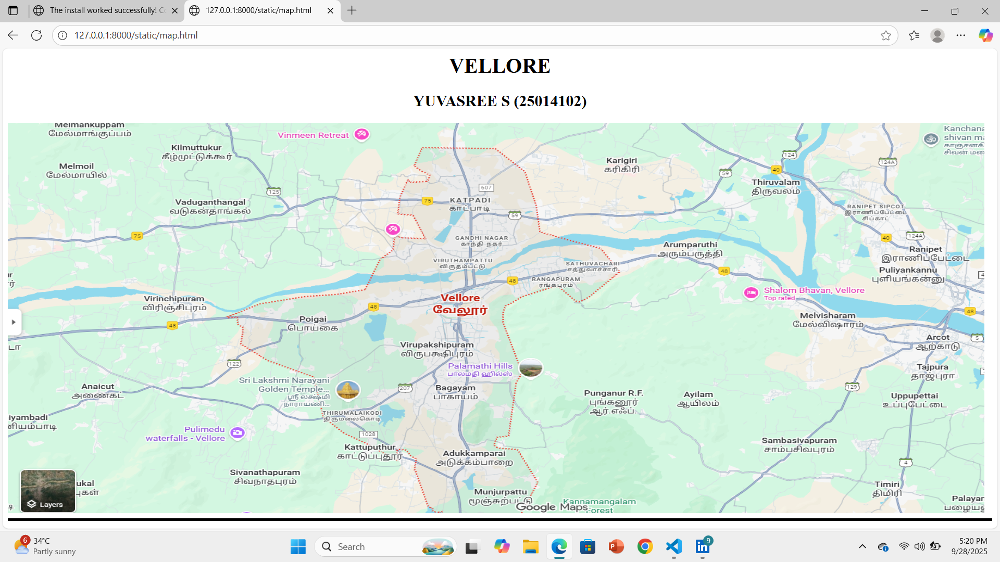
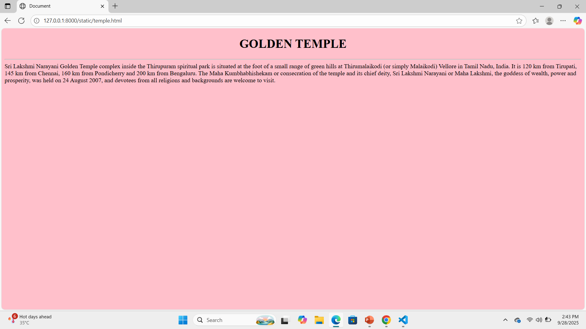
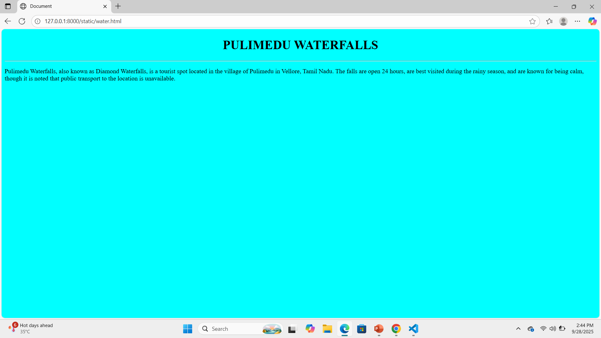
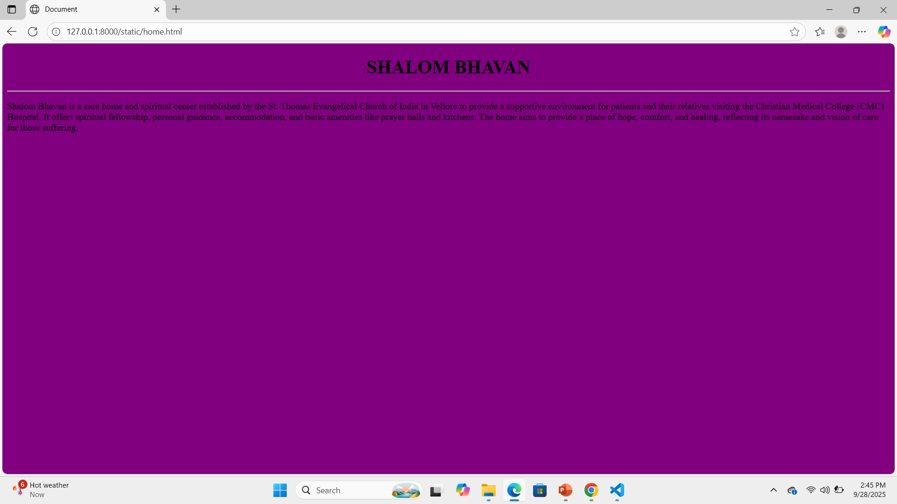
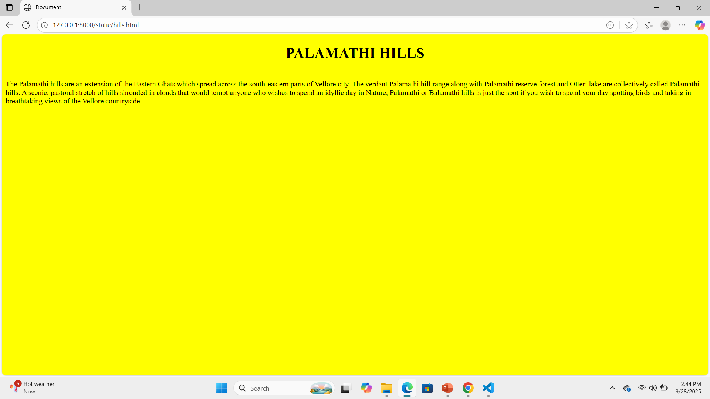
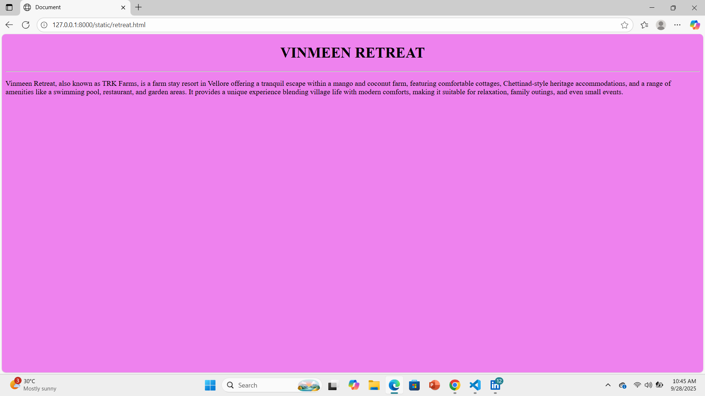

# Ex04 Places Around Me
## Date:28.09.2025

## AIM
To develop a website to display details about the places around my house.

## DESIGN STEPS

### STEP 1
Create a Django admin interface.

### STEP 2
Download your city map from Google.

### STEP 3
Using ```<map>``` tag name the map.

### STEP 4
Create clickable regions in the image using ```<area>``` tag.

### STEP 5
Write HTML programs for all the regions identified.

### STEP 6
Execute the programs and publish them.

## CODE
```
map.html
<html>
    
        <body>
            <h1 align="center">VELLORE</h1>
            <h2 align="center">YUVASREE S (25014102)</h2>
        

         <map name="image-map">
         <area target="" alt="Golden temple" title="Golden temple" href="temple.html" coords="392,564,575,639" shape="rect">
         <area target="" alt="Pulimedu Waterfalls" title="Pulimedu Waterfalls" href="water.html" coords="292,675,100" shape="circle">
         <area target="" alt="Shalom Bhavan" title="Shalom Bhavan" href="home.html" coords="1288,357,1520,407" shape="rect">
         <area target="" alt="Palamathi Hills" title="Palamathi Hills" href="hills.html" coords="760,536,901,523,893,588,781,585" shape="poly">
         <area target="" alt="Vinmeen Retreat" title="Vinmeen Retreat" href="retreat.html" coords="459,7,646,8,622,71,556,92,474,63" shape="poly">
         </map>
         <hr size="5" color="black">
        </body>
</html>

temple.html


<html>

<body bgcolor="pink">
    <h1 align="center">GOLDEN TEMPLE</h1>
    <hr size="2>"
    <p>
        Sri Lakshmi Narayani Golden Temple complex inside the Thirupuram spiritual park is situated at the foot of a small range of green hills at Thirumalaikodi (or simply Malaikodi) Vellore in Tamil Nadu, India. It is 120 km from Tirupati, 145 km from Chennai, 160 km from Pondicherry and 200 km from Bengaluru. The Maha Kumbhabhishekam or consecration of the temple and its chief deity, Sri Lakshmi Narayani or Maha Lakshmi, the goddess of wealth, power and prosperity, was held on 24 August 2007, and devotees from all religions and backgrounds are welcome to visit.
    </p> 
 
    
</body>

</html>

water.html


<html>

<body bgcolor="cyan">
    <h1 align="center">PULIMEDU WATERFALLS</h1>
    <hr size="2">
    <p>
       Pulimedu Waterfalls, also known as Diamond Waterfalls, is a tourist spot located in the village of Pulimedu in Vellore, Tamil Nadu. The falls are open 24 hours, are best visited during the rainy season, and are known for being calm, though it is noted that public transport to the location is unavailable. 
    </p>
</body>
</html>

home.html


<html>

<body bgcolor="purple">
    <h1 align="center">SHALOM BHAVAN</h1>
    <hr size="2">
    <p>
        Shalom Bhavan is a care home and spiritual center established by the St. Thomas Evangelical Church of India in Vellore to provide a supportive environment for patients and their relatives visiting the Christian Medical College (CMC) Hospital. It offers spiritual fellowship, personal guidance, accommodation, and basic amenities like prayer halls and kitchens. The home aims to provide a place of hope, comfort, and healing, reflecting its namesake and vision of care for those suffering.
    </p>
</body>
</html>

hills.html


<html>

<body bgcolor="yellow">
    <h1 align="center">PALAMATHI HILLS</h1>
    <hr size="2">
    <p>
       The Palamathi hills are an extension of the Eastern Ghats which spread across the south-eastern parts of Vellore city. The verdant Palamathi hill range along with Palamathi reserve forest and Otteri lake are collectively called Palamathi hills.
       A scenic, pastoral stretch of hills shrouded in clouds that would tempt anyone who wishes to spend an idyllic day in Nature, Palamathi or Balamathi hills is just the spot if you wish to spend your day spotting birds and taking in breathtaking views of the Vellore countryside.
    </p>
</body>
</html>

retreat.html

<html>

<body bgcolor="violet">
    <h1 align="center">VINMEEN RETREAT</h1>
    <hr size="2">
    <p>
        Vinmeen Retreat, also known as TRK Farms, is a farm stay resort in Vellore offering a tranquil escape within a mango and coconut farm, featuring comfortable cottages, Chettinad-style heritage accommodations, and a range of amenities like a swimming pool, restaurant, and garden areas. It provides a unique experience blending village life with modern comforts, making it suitable for relaxation, family outings, and even small events.
    </p>
</body>
</html>
```
## OUTPUT








## RESULT
The program for implementing image maps using HTML is executed successfully.
